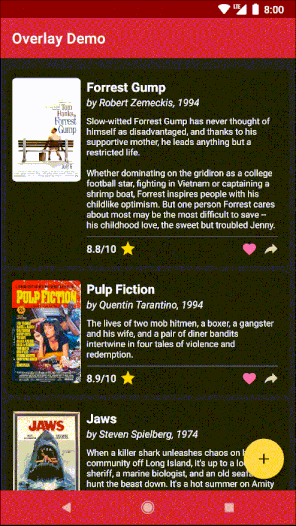
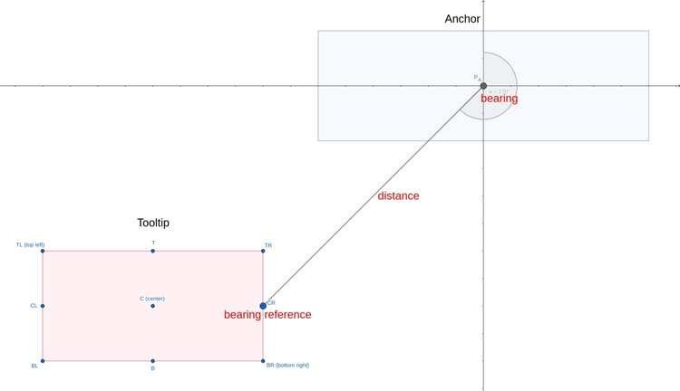

# Overview

This is a little Android library that provides a convenient way to add an overlay with the ability to highlight and access widgets underneath it. 
It can be useful for two common scenarios:

* Building an _in-app tutorial_ with **accents** and **tooltips**. Accents draw user's attention to certain parts of your UI while tooltips provide user with some information regarding those parts.
* Building _custom UI controls_ that require widgets belonging to a view under the overlay to show through. For example, the demo app uses this library to implement a dimming floating action menu. This scenario doesn't involve tooltips.

The overlay is designed to have a minimal impact on your view hierarchy:

* It sits on top of a `ContentFrameLayout` which is created by the Android framework. No extra nesting is required in most cases.
* It is created immediately before shown and destroyed after dismissed. There are no invisible views.
* It does not keep strong references to your UI.

The overlay is also customizable in ways it handles touch events and supports custom animations.

NOTE: The API is aimed at Kotlin and may be cumbersome if used from Java.

# Demo




# Usage

1. Add JitPack repo in your root `build.gradle` at the end of repositories:
    ```
    allprojects {
       repositories {
          // ...
          maven { url 'https://jitpack.io' }
       }
    }
    ```
2. Add dependency:
    ```
    dependencies {
       implementation 'com.github.squeezymo.spotlight:overlay:{version}'
    }
    ```
3. Make sure your activity is a standard activity that implements `LifecycleOwner` (namely, `AppCompatActivity` or `FragmentActivity`).
4. In your activity, replace `setContentView()` with `setContentViewWithOverlay()`:
    ```
   override fun onCreate(savedInstanceState: Bundle?) {
      super.onCreate(savedInstanceState)
      setContentViewWithOverlay(layoutResId)
      // ...
   }
    ```
5. When you need to show an overlay, get a reference to a `SpotlightController` with an extension property `spotlightController` from your Activity or Fragment. Be sure to call it after `setContentViewWithOverlay()`.

### Accents

View can be accented (highlighted) in four manners:

| Shape | Parameters | Example |
| ----------- | ----------- | -----------
| `ExactViewShape` | `scale` |  |
| `Circle` | `scale` |  |
| `Oval` | `scale` |  |
| `Rectangle` | `scale`, `roundPx` for rounded corners |  |

### Tooltips

Any view can be used as a tooltip. Tooltips are positioned relative to their anchors. Usually you will use your accented view for an anchor but generally they don't have to be the same. The position is given with a **bearing angle** (or simply **bearing**), a **bearing reference** and **distance**. These values are part of the tooltip's layout parameters (`TooltipsViewGroup.LayoutParams`).

Bearing is expressed in degrees. 0°/90°/180°/270° respectively correspond to a tooltip above/to the right of/below/to the left of its anchor. Bearing reference is one of the 9 points of the tooltip with respect to which bearing angle and distance are provided.



If you don't care about the exact position of the tooltip, you can use utility methods `TooltipsViewGroup.LayoutParams.suggestBearing()` and `TooltipsViewGroup.LayoutParams.suggestBearingReference()` to let the library try to define these values for you based on the position of the anchor on the screen.
